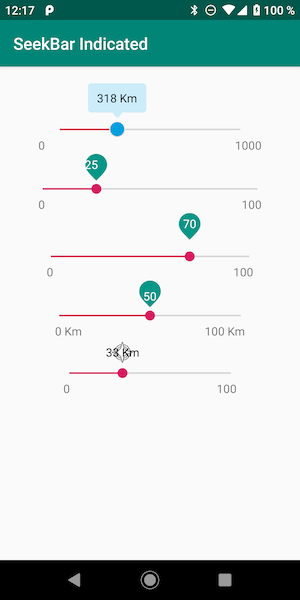

## FEATURES

Customize the progress mark margins, text (formatted strings and colors) and drawable. 

## CODE EXAMPLE

        <com.vsa.sbi.SeekBarIndicated
                android:id="@+id/seekBarTest"
                android:layout_width="match_parent"
                android:layout_height="wrap_content"
                android:layout_marginLeft="10dp"
                android:layout_marginRight="10dp"
                app:indicator_formatString="@string/indicator_km"
                app:indicator_src="@drawable/img_filter_box"
                app:indicator_textCenterHorizontal="true"
                app:indicator_textColor="@android:color/black"
                app:indicator_textMarginTop="8dp"
                app:seekbar_indicatorDistance="5dp"
                app:seekbar_maxValue="1000"
                app:seekbar_minValue="0"
                app:seekbar_thumb="@drawable/img_filter_slider" />

## GRADLE

    compile 'com.vsa:sbi:1.2.4'